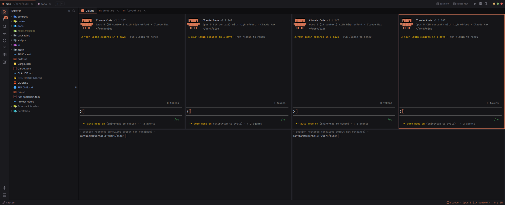
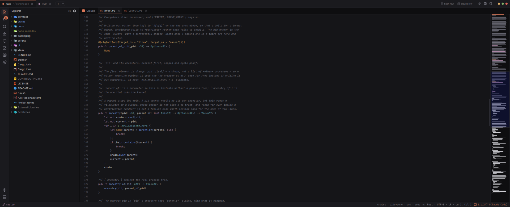
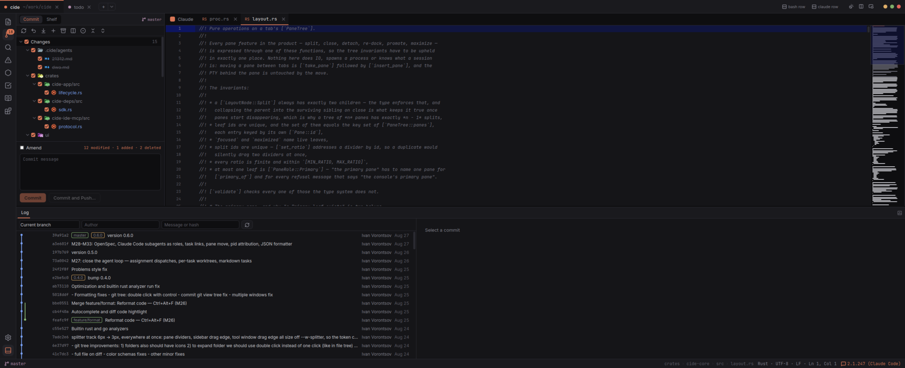
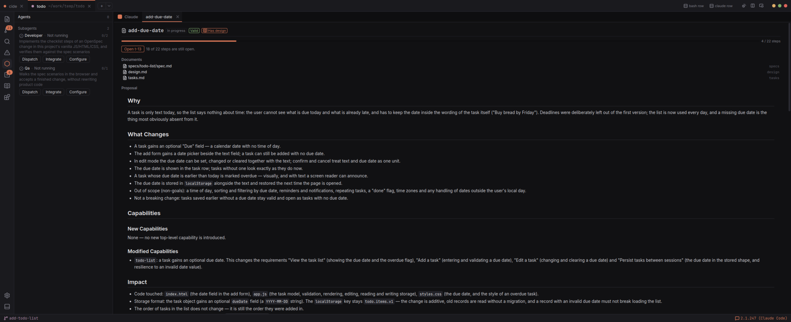
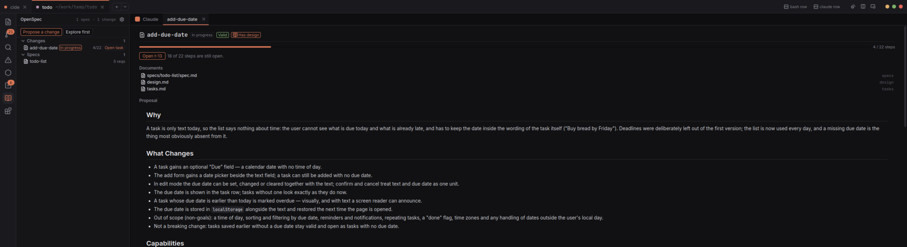
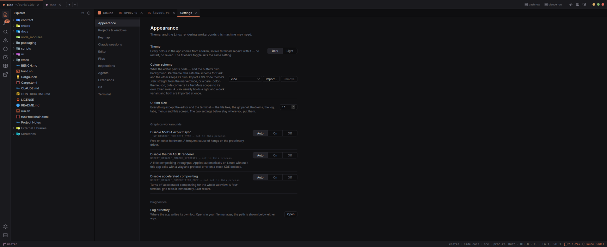

# cide

An IDE whose centre of gravity is a live Claude Code session rather than a text buffer.



Every project opens with a **pinned, non-closable Claude tab** hosting a tiling grid of panes —
the project's primary Claude session, further sessions, plain shells, read-only diffs — with the
ordinary IDE furniture around it: a file tree, a tabbed editor with real language servers, an
IDEA-style git tool window, and `Ctrl+P` / `Ctrl+Shift+F` / `Ctrl+Shift+P` where you
expect them.

cide registers as a **real Claude Code IDE**, not as a terminal that happens to contain one. It
serves the IDE-integration MCP server, so the agent's edits arrive as diffs in cide's own editor,
`getDiagnostics` answers from the language server cide is already running, and `Ctrl+G` in a
session opens the plan in a cide tab. Sessions belong to the Rust core rather than to any window,
so a pane can be torn into its own window, a window can be closed, and the conversation lives on
and resumes on the next launch.

Rust + Tauri 2 backend, React 19 + Vite 8 frontend. **Linux-first**, developed on KDE/Wayland.

---

## What is in it

### The editor, with language servers that are actually there



CodeMirror 6 surfaces over an LSP client written as threads rather than tokio. A packaged cide
**carries its own rust-analyzer** — a fork with a disk index, so a large workspace is warm on the
second launch — and its own **gopls**; a source build uses whatever is on your `PATH`, and any
other server can be contributed by an extension. Completion with lazily resolved auto-imports,
diagnostics that follow the disk, go-to-definition and go-to-implementation, Find usages, folding,
blame, an outline, a markdown preview, and Shift+Alt+F to reformat.

### Git, at the granularity you actually commit in



Multi-root, with hunk- and line-level staging, changelists and a shelf (ADR 0004 — changelists,
not the index). A log with graph lanes, file history, blame, and the commit actions: amend, reset,
tag, cherry-pick and revert. Pull with merge or rebase, and a conflict resolver driven by the real sequencer
state rather than a guess about it (ADR 0009). The commit tool window docks at the bottom, the way
an IDEA user expects it to.

### Agent roles, tasks, and the loop between them



`.cide/` holds a task tracker Claude can call — `cide_task_*` over MCP — and agent **roles**,
including Claude Code subagents used as roles cide can dispatch. Assign a task and the role starts
in its own git worktree under `.cide/worktrees/`; the roster follows the disk, tasks carry typed
links (related, blocked-by, subtask-of), and finished work is integrated back through the UI.

### Specs the agents work from



If a project uses [OpenSpec](https://github.com/Fission-AI/OpenSpec), cide reads it by running the
`openspec` CLI — never by parsing its markdown (ADR 0012). Changes, specs, the requirement deltas
and the checklist appear as a panel and as documents, a change can be opened as a task, and the
workflow commands are dispatched into the session that is already running.

### Yours to configure



Themes in dark and light, **VS Code colour themes imported** from a `.vsix` or a bare
`-color-theme.json` and converted to cide's own token roles, a keymap editor over one command
registry that the palette and the bindings both read from, per-project window modes, extensions
from a marketplace that is just a git repository (ADR 0010), and the Linux graphics workarounds
this kind of app needs, each with a plain sentence saying what it does.

---

## Install

Prerequisites: **Rust 1.92**, **Node + pnpm**, **WebKitGTK 4.1 / GTK 3**, and the
[`claude` CLI](https://docs.claude.com/en/docs/claude-code) installed and authenticated — cide
hosts it, it does not ship it.

```sh
git clone https://github.com/lantian/cide && cd cide
pnpm --dir ui install
./run.sh                   # builds and launches from the working tree
```

That is the whole of it: a source build finds `rust-analyzer` and `gopls` on your `PATH` and
needs nothing else.

**A packaged build carries its own language servers**, and that is the one extra step:
`./build.sh` produces an AppImage and installs it into `~/bin`, but it first needs cide's three
sibling forks — a patched rust-analyzer, the salsa it is built against, and a gopls — checked out
beside the repository. `./scripts/clone-forks.sh` does that, at the revisions `packaging/*.lock`
pin; [`docs/forks.md`](docs/forks.md) is what they are and why. `cargo xtask package` can also
produce a `.deb`, a Flatpak, a binary tarball or a source tarball.

[CONTRIBUTING.md](CONTRIBUTING.md) has the rest: the run.sh flags, profiles, every check CI runs,
and packaging.

cide never reads `~/.claude/.credentials.json` and never injects `ANTHROPIC_API_KEY`: that
variable outranks subscription OAuth and would silently bill a Console org. Children inherit their
auth by inheriting the environment.

## Status

**0.6.0, and honest about being early.** It is used every day to build itself, which is the only
endorsement on offer.

- **Linux is the only platform cide has ever run on.** The macOS arms compile and are reasoned
  about; nobody has run them. [`docs/platforms.md`](docs/platforms.md) is the record of exactly
  what is known and what is only read. Windows is not a target.
- Several features have acceptance criteria that were never confirmed on a display.
  [`docs/journal.md`](docs/journal.md) says which, per milestone, in the words they were written
  in.
- The Claude Code IDE surface is undocumented and unversioned upstream, so it sits behind one
  adapter with a pinned known-good CLI range and degrades to plain-PTY-only if the handshake
  fails.

## How it works

**One webview per OS window; panes are DOM.** Tauri's `unstable` multiwebview is the obvious way
to build a pane grid and is functionally broken on Linux — splitter drags would be silent no-ops
that still return `Ok(())`. See ADR 0001.

**Rust owns everything durable.** A gesture goes `client.ts → #[tauri::command] → a validated
mutation in cide-core → one event to every window → a mirror store in the webview that never edits
the tree`. Two windows editing one tree would give two answers, and a detached pane is a separate
JavaScript realm with no shared memory. See ADR 0002.

**Sessions live outside the tree**, in a process-global registry keyed by `SessionId` — which *is*
the value passed to `claude --session-id`, so resume is free. A pane merely attaches; closing a
pane, tab or window never touches the child. Sinks are a list, so a detach is gapless.

```
crates/
  cide-app/       the Tauri shell — the only crate that may depend on tauri
  cide-ipc/       wire DTOs (serde + ts-rs): in-memory domain, disk format and wire format at once
  cide-core/      behaviour over those DTOs: workspace tree, keymap, commands, VS Code theme import
  cide-pty/       PTY sessions: spawn, coalescing, backpressure, vt100 mirror
  cide-claude/    spawning and supervising `claude`: env, hooks, resume/fork, headless one-shots
  cide-ide-mcp/   the Claude Code IDE-integration MCP server
  cide-git/       multi-root git: staging, changelists, log, blame, merge, conflicts
  cide-fs/        gitignore-aware indexing and watching      cide-search/  fuzzy + content search
  cide-tasks/     `.cide/tasks.json`                         cide-spec/    OpenSpec, via its CLI
  cide-agents/    roles, config, and the `cide_task_*` MCP vocabulary
  cide-lang/      tree-sitter: what a file declares           cide-lsp/     an LSP *client*
  cide-deps/      what a project depends on, and where its source is unpacked
  cide-ext/       extensions, marketplaces, and which contribution wins
  cide-hook/      bridges a Claude hook to the running IDE   cide-headless/ proves the core links
                                                                            without tauri
```

## Documentation

| | |
| --- | --- |
| [CONTRIBUTING.md](CONTRIBUTING.md) | build, run, check, package — everything CI runs, in CI's order |
| [docs/adr/](docs/adr/) | the decisions a refactor would otherwise undo, with the losing option written down |
| [docs/platforms.md](docs/platforms.md) | what is known, and what is only read, off Linux |
| [docs/journal.md](docs/journal.md) | the milestone-by-milestone record, including what was never verified |
| [docs/forks.md](docs/forks.md) | the three sibling forks, their pins, and what moving one costs |
| [BENCH.md](BENCH.md) | the IPC transport measurement the pane grid is built on |

## Licence

MIT — see [LICENSE](LICENSE).
